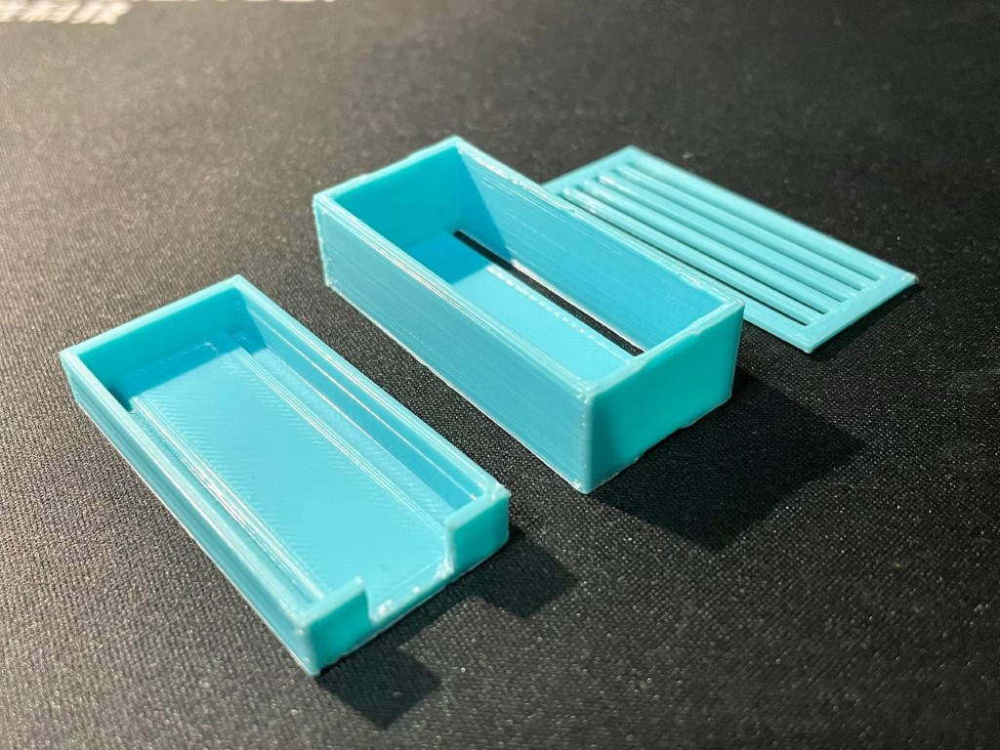
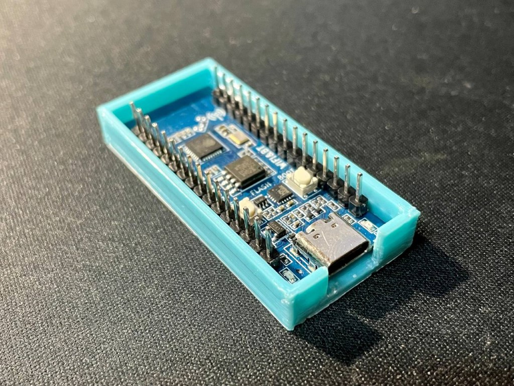
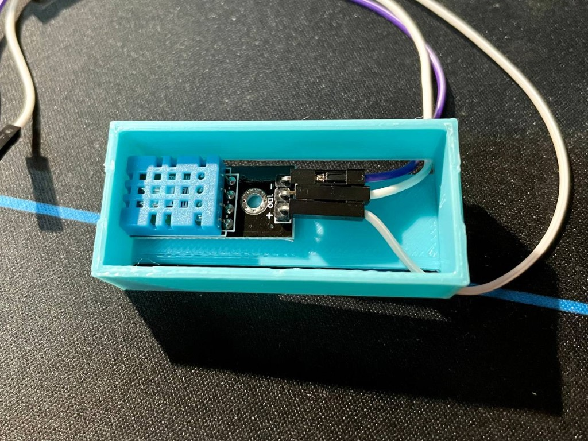
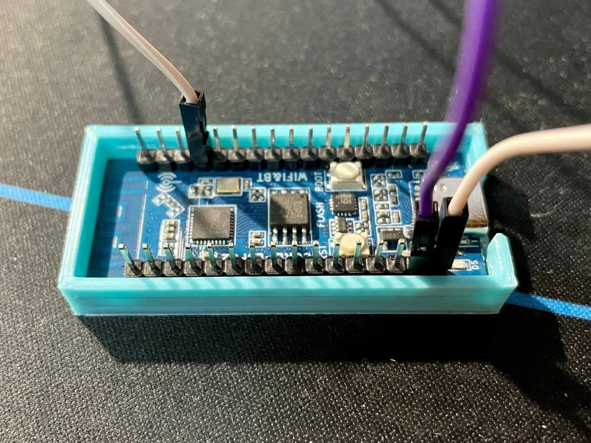
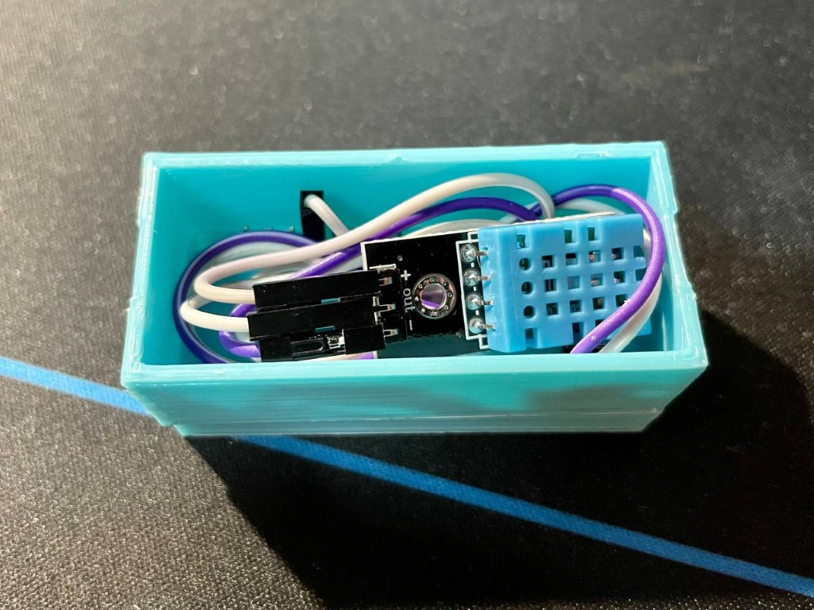
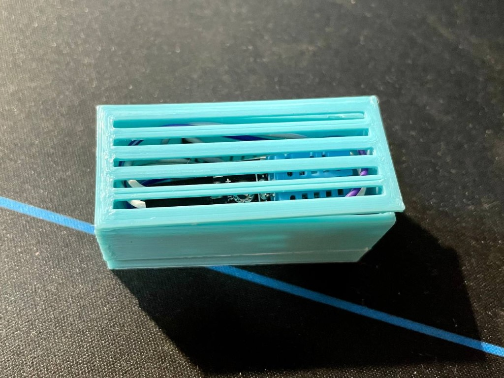

# Sensor Housing

## Assemble Steps

### 1. Install the demo board

### 2. Install the DHT sensor

Pass the wire through the gap.

### 3. Connect sensor and demo board

- \+ -- 5V

- \- -- GND

- data -- IO12

### 4. Cable management

Now you can glue the first and second layer.

### 5. Add the top cover

Finally you can glue the top cover to the second layer.